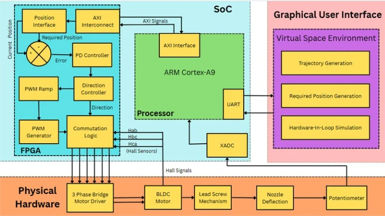
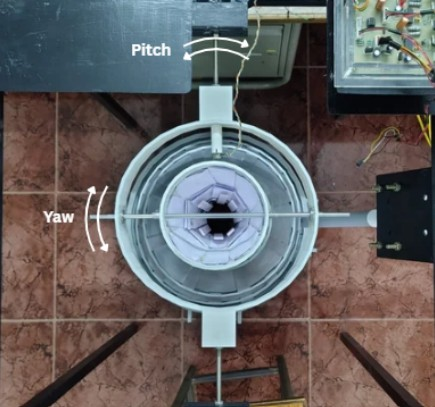

# FPGA-Based Hardware-in-the-Loop Platform for Spacecraft Thrust Vector Control

A real-time Hardware-in-the-Loop (HIL) platform for validating spacecraft thrust vector control using an FPGA-based controller, BLDC motor-driven gimbal mechanism, and a Virtual Spacecraft Environment.

---

## 📖 Overview

This project presents the design and development of an FPGA-based Hardware-in-the-Loop (HIL) platform for spacecraft thrust vector control (TVC). The platform combines a physical thrust vector actuator with a virtual spacecraft simulation to validate control algorithms under real-time operating conditions.

The system consists of:

- Xilinx ZedBoard FPGA
- FPGA-based PD Controller
- Custom BLDC Motor Driver
- BLDC Motor with Lead Screw Actuator
- Dual-Axis Gimbal Mechanism
- Potentiometer Position Feedback
- Virtual Spacecraft Environment (Python)
- UART Communication Interface

The platform enables the virtual spacecraft to interact with the physical actuator, creating a realistic environment for testing thrust vector control systems.

---

## 🎯 Objectives

- Develop an FPGA-based closed-loop position controller.
- Design a BLDC motor-driven thrust vector actuator.
- Implement a Hardware-in-the-Loop validation platform.
- Integrate a Virtual Spacecraft Environment with physical hardware.
- Validate real-time spacecraft thrust vector control.

---

## 🏗 System Architecture

> 

<p align="center">

</p>

---

## ⚙️ Hardware Components

| Component | Description |
|------------|-------------|
| FPGA Board | Xilinx ZedBoard |
| Motor | BLDC Motor |
| Motor Driver | Custom Three-Phase BLDC Driver |
| Position Sensor | Potentiometer |
| Actuator | Lead Screw Mechanism |
| Gimbal | Dual-Axis Gimbal |
| Communication | UART |

---

## 💻 Software Stack

- Vivado 2022.2
- Verilog HDL
- Python
- PyQt
- MATLAB
- UART Serial Communication

---

## 📂 Repository Structure

```text
THRUST-VECTOR-CONTROL-OF-SPACECRAFT
│
├── docs/
│   ├── Thesis.pdf
│   ├── Presentation.pdf
│   └── Report.pdf
│
├── fpga/
│   ├── HDL/
│   ├── Constraints/
│   └── Vivado_Project/
│
├── python/
│   ├── gui/
│   ├── serial/
│   ├── simulation/
│   └── assets/
│
├── matlab/
│
├── hardware/
│   ├── Driver/
│   ├── Gimbal/
│   ├── Nozzle/
│   ├── Lead_Screw/
│   └── Photos/
│
├── images/
│
├── videos/
│
└── README.md
```

---

## 🔄 Control Flow

```text
Virtual Spacecraft Environment
            │
            │ UART
            ▼
      Xilinx ZedBoard
   ┌────────────────────┐
   │ Processing System  │
   │ UART + XADC        │
   └─────────┬──────────┘
             │
             ▼
   ┌────────────────────┐
   │ Programmable Logic │
   │                    │
   │ • PD Controller    │
   │ • PWM Generator    │
   │ • BLDC Control     │
   └─────────┬──────────┘
             │
             ▼
      BLDC Motor Driver
             │
             ▼
         BLDC Motor
             │
             ▼
        Lead Screw
             │
             ▼
      Gimbal & Nozzle
             ▲
             │
      Potentiometer
             │
             └────── XADC Feedback
```

---

## 📸 Hardware Prototype

### Complete Experimental Setup

> *(Insert image)*

<p align="center">

</p>

---

### Gimbal Mechanism

> *(Insert image)*

<p align="center">

</p>

---

### BLDC Motor Driver

> *(Insert image)*

<p align="center">

</p>

---

## 🖥 Virtual Spacecraft Environment

> *(Insert screenshot)*

<p align="center">

</p>

---

## 📊 Results

The developed system successfully demonstrates:

- Real-time FPGA-based PD control
- Accurate nozzle position tracking
- Hardware-in-the-Loop validation
- Stable BLDC motor control
- Real-time communication between simulation and hardware

---

## 🚀 Future Work

- Two-axis thrust vector control
- Advanced control algorithms (LQR, MPC)
- Improved spacecraft dynamics
- Higher-speed communication interfaces
- High-precision position sensing
- Space-grade actuator implementation

---

## 📚 Publications / Thesis

**Title:**

> FPGA-Based Hardware-in-the-Loop Platform for Spacecraft Thrust Vector Control

**Institution:**

National Institute of Technology Calicut

M.Tech in 

---

## 👨‍💻 Author

**Akash S**

M.Tech – Electronics Design and Technology

National Institute of Technology Calicut

---

## 📄 License

This project is licensed under the MIT License.
